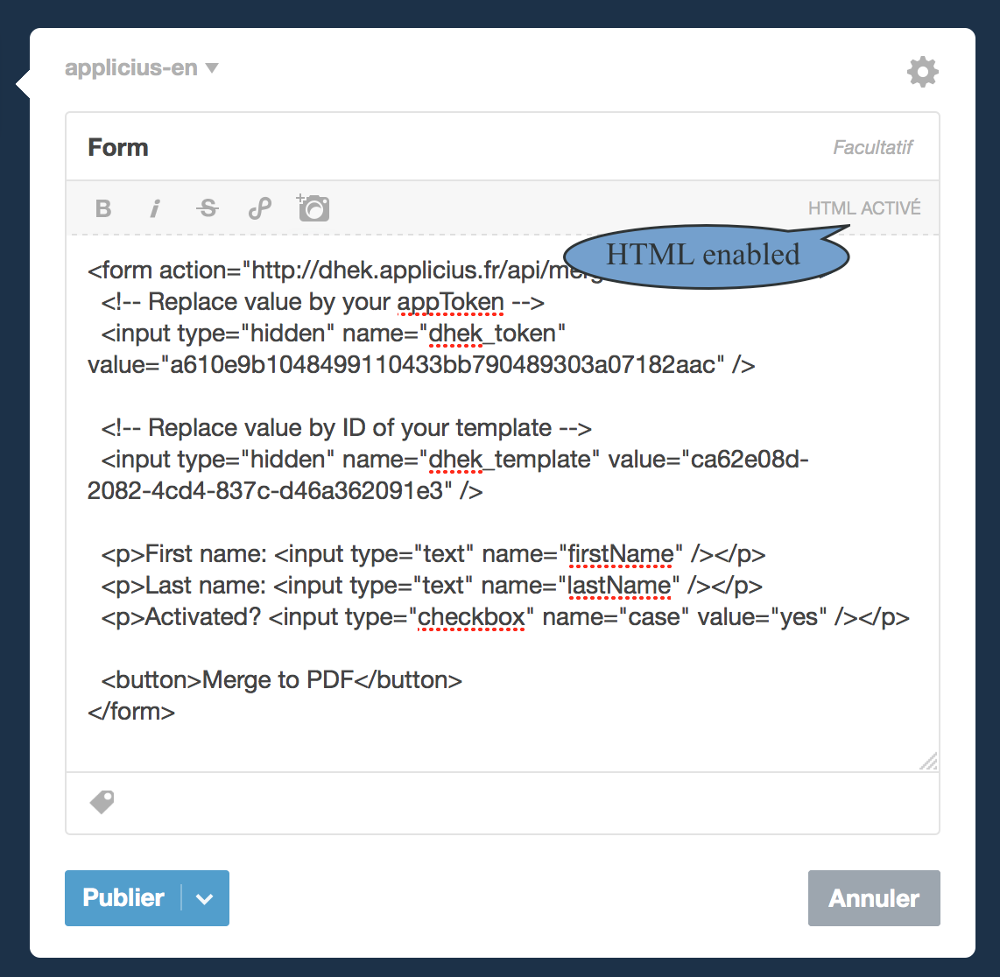
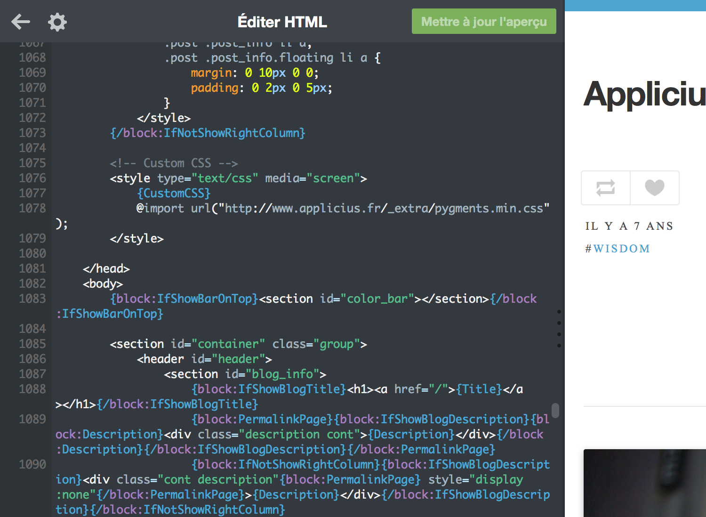

# Dhek Web Service - Developer Guide

You will find there how to use Dhek from your sites.

## Form-to-PDF

Merge API to fill form values into PDF/Dhek template is exposed as plain `POST` HTTP call.

It's can be easily tested with HTTP tool, like cURL:

```
curl -o example.pdf -X POST \
  -d 'dhek_token=a610e9b1048499110433bb790489303a07182aac' \
  -d 'dhek_template=ca62e08d-2082-4cd4-837c-d46a362091e3' \
  -d 'firstName=First&lastName=Last&case=yes' \
  http://dhek.applicius.fr/api/merge
```

From this test, generated PDF is download as `example.pdf` file.
Following parameters are passed to merge URL (http://dhek.applicius.fr/api/merge):

- `dhek_token` (Mandatory): Application token of your account (see "My account" screen).
- `dhek_template` (Mandatory): ID of template you want to merge form values with. It's displayed in a badge aside template information in "My account" screen.
- `firstName`: A parameter matching `firstName` text area defined in used template.
- `lastName`: A parameter matching `lastName` text area defined in used template.
- `case`: A parameter matching `case` checkbox area defined in used template.

> As for parameter provided for checkbox area, following case insensitive values area considered true: `yes`, `y` or `on`.

### HTML/plain form submission

Anywhere you can manage a HTML form, you can update it so that it submit data to Dhek merge API.

```html
<form action="http://dhek.applicius.fr/api/merge" method="POST">
  <!-- Replace value by your appToken -->
  <input type="hidden" name="dhek_token" value="a610e9b1048499110433bb790489303a07182aac" />

  <!-- Replace value by ID of your template -->
  <input type="hidden" name="dhek_template" value="ca62e08d-2082-4cd4-837c-d46a362091e3" />

  <p>First name: <input type="text" name="firstName" /></p>
  <p>Last name: <input type="text" name="lastName" /></p>
  <p>Activated? <input type="checkbox" name="case" value="yes" /></p>

  <button>Merge to PDF</button>
</form>
```

In previous example:
- (Mandatory) Attribute `action` of `form` tag references merge API, and attribute `method` is set to (HTTP) `POST`.
- (Mandatory) Hidden fields (`<input type="hidden" ... />`) are defined for required merge parameters `dhek_token` (appToken) and `dhek_template` (ID of template).
- For each key of areas defined in Dhek template (here `firstName`, `lastName` and `case`), corresponding fields are added to firm (here `<input type="text" ... />` and `<input type="checkbox" ... />`).
- Finally, `button` allow visitor to submit this form.

> There is no form validation with such integration.
> Plain form submission can be used where you can't call custom Javascript, or where validation/custom processing is not required.

### Javascript

PDF merge can be called directly on your pages with JS, using AJAX/XHR features. Doing so you can check data as you want before pushing them into PDF.

A **jQuery** plugin is provided [there](./src/main/js/jquery-dhek.js), and can be used as following:

```javascript
$.dhek({
  'action': "merge",
  'dhek_token': "a610e9b1048499110433bb790489303a07182aac", // replace by yours
  'dhek_template': "ca62e08d-2082-4cd4-837c-d46a362091e3", // replace by yours
  'data':"#formId",
  // or as dictionary -> 'data':{'firstName':"First"}
  // 'form_target': "_blank",
});
```

*TODO: Link a sample page using such JS*

In previous example, following options are used:
- `action` with `"merge"` value: Indicate jQuery Dhek plugin which action should be processed.
- `dhek_token`: Application token of your account (see "My account" screen).
- `dhek_template`: ID of template you want to merge form values with. It's displayed in a badge aside template information in "My account" screen.
- `data`: Field data to be merge with PDF/Dhek template. It can be either a [jQuery selector](http://api.jquery.com/category/selectors/) referencing a form element (e.g. `"#formId"`), or a plain JS dictionary (array with string a keys, e.g. `{'firstName':"First"}`). 
  - If a form element is specified (jQuery selector), fields (text/radio/checkbox/email/password/... input, select and textarea) are considered, name of each having to match an area key defined in template, or its value is silently ignored/considered undefined.
  - If dictionary is given, each key should match an area key defined in template, or it's ignored (considered undefined).

If you want to have not editable value merged using such jQuery plugin, you can either add hidden (`<input type="hidden" name="area_key" value="uneditable_value" />`) or readonly (`<input type="text" readonly="readonly" name="area_key" value="uneditable_value" />`) field, when specifying data as form selector, or adding an hardcoded/static entry if using dictionary.

> jQuery must be available to use this plugin.

### Tumblr

Form can be added to your [Tumblr](http://www.tumblr.com) blog, *adding Text post* with *HTML enabled* in content editor. There you can add HTML code for form in post content.



(see code sample for [HTML/plain form submission](#htmlplain-form-submission))

Thanks to Tumblr customization features, you can also call merge API using **[Javascript](#javascript)**.


On customization screen, click to edit your blog HTML, to add `<script src="http://url/to/jquery-dhek.js"></script>` add end of header (before `</head>`).

